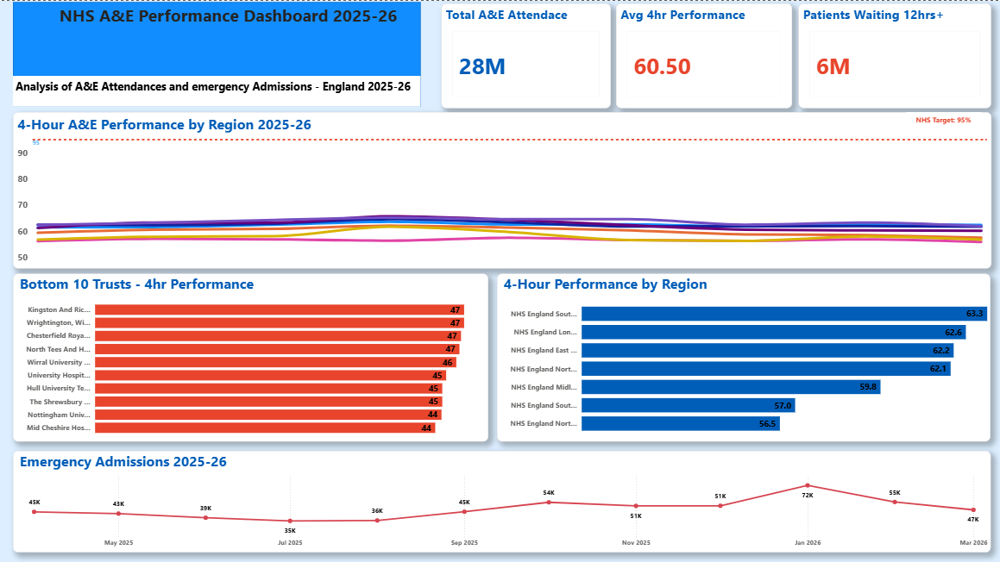

# nhs-ae-performance-analysis
NHS A&E Performance Analysis 2025–26

Project Overview
An end-to-end data analysis project examining
A&E waiting times and emergency admissions across
all NHS Trusts in England from April 2025 to
March 2026.

This project replicates the type of analysis
performed by real NHS data analysts to monitor
performance against the 95% four-hour waiting
time target.

───

Key Findings
• No NHS region met the 95% four-hour target
in any month — the best performer (South East)
averaged just 63.3%
• 1 in 4 patients nationally waited over 12 hours
in A&E throughout the year
• January 2026 was the worst month nationally —
emergency admissions spiked to 71,517, nearly
double the July low of 35,467
• Mid Cheshire NHS Trust was the worst performing
Trust in England with only 43.6% of patients
seen within four hours
• The Midlands recorded the highest total 12-hour
waits — over 1.25 million patients in one year

───

Tools Used
• Excel — data cleaning and preparation
• PostgreSQL — data storage and analysis
• Power BI — interactive dashboard

───

Data Source
NHS England — Monthly A&E Attendances and
Emergency Admissions
https://www.england.nhs.uk/statistics/statistical-work-areas/ae-waiting-times-and-activity/

───

SQL Queries
Five analytical queries were written to answer:
1. 4-hour performance by region over time
2. Bottom 10 worst performing Trusts
3. National 12-hour waits trend
4. Best vs worst region comparison
5. Monthly emergency admissions trend

All queries are saved in the /queries folder.

───

Dashboard Preview

───

How to Use This Repository
1. Download ae_master.csv for the cleaned dataset
2. Run queries in the /queries folder against
the dataset in PostgreSQL
3. Open NHS_AE_Dashboard.pbix in Power BI Desktop
to explore the interactive dashboard
4. View NHS_AE_Dashboard_2025_26.pdf for a
static version of the dashboard

───

Created by Benjamin Dadzie | June 2026
